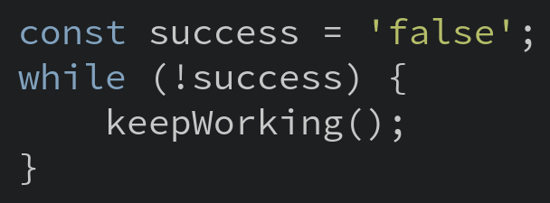

# Code Snipper for VSCode

This is an extension for [Code Snipper](https://github.com/abhisheksoni27/code-snipper) that creates images from code snippets from vscode.

## Features

* Create an image from a file
* Create an image from selected text

```js
const success = 'false';
while(!success){
    keepWorking();
}
```



> TODO: Add animation

## Extension Settings

Default settings:

* `code-snipper.resolution: 1`
* `code-snipper.theme: 'hybrid'`
* `code-snipper.font: 'Source Code Pro'`
* `code-snipper.fontSize: 20`

**Available Themes**

All the themes available in [hightlight.js](https://highlightjs.org/) can be used. The list can be found at [Themes.md](https://codeprose.me/code-snipper/themes.html)

To check out how each theme looks, check this [Highlight.js demo](https://highlightjs.org/static/demo/)
Include if your extension adds any VS Code settings through the `contributes.configuration` extension point.

## Known Issues


## Release Notes

### 1.0.0

Initial release

-----------------------------------------------------------------------------------------------------------
